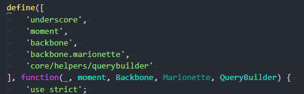
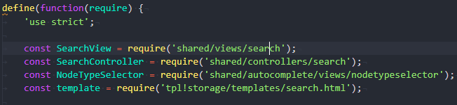
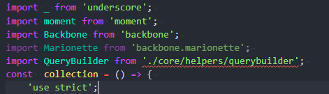
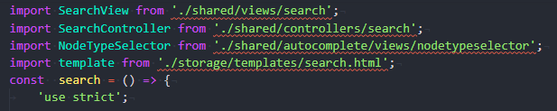
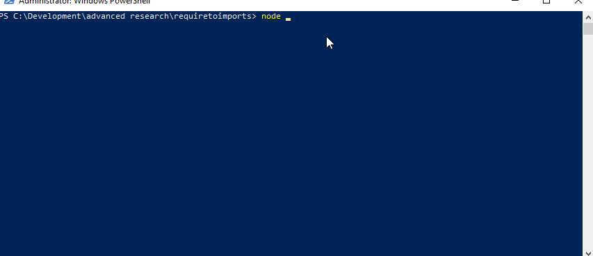

# Require To Imports


Take your old files that use AMD require.

and magically ~~break them.~~ turn them into files that use es6 imports!<br/>

# Code style <br/>

The transpiler focuses on code written using the ```define()``` function, either with an array of paths as the first argument: <br /><br />


## OR <br/>
with a bunch of require declarations <br/><br/>


<br/><br/>

These transpile into: <br/><br/>



## AND <br />



# Usage and Commands <br/><br/>



# commands

typical usage: <br/>
```node index tr -r './myoldsauce' './mynewsauce'```

This will read all files in your ```myoldsauce``` folder, transpile them and output them into the ```mynewsauce``` folder. I recommend not transpiling into the same dir <br /><br/>

the ```tr``` command takes the following options

```-r, --recursive, transpile recursively``` <br/>
```-l, --verbose, verbose```<br/>
```-f, --fix, fix path strings, this adds "./" to the begining of input paths```<br/>
```-h, --help, shows usage information```<br/>

# Gotchas <br/>

The transpiled code is wrapped in an object that exports as default at the bottom of the file. The name of this function is the name of the file itself.<br/>
use ```--fix``` to fix path strings will only fix paths... it'll fix ```my/dir``` but not ```underscore```<br/>
verbose is quite verbose ...Just ask Vegeta.

My use case
------

Have an old project that uses the old defines/require functions to pull in dependencies.
Want to upgrade this without having to go through each file manually.
